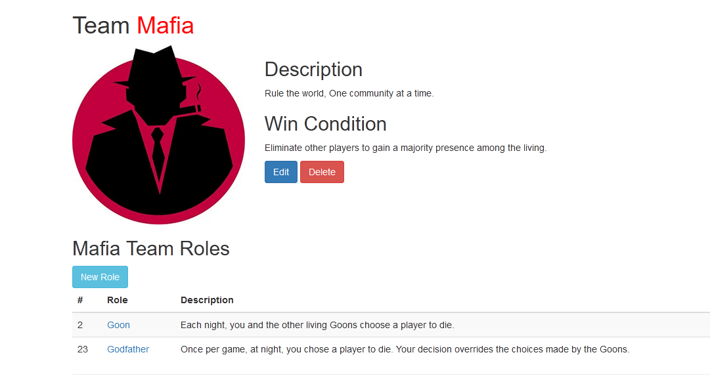
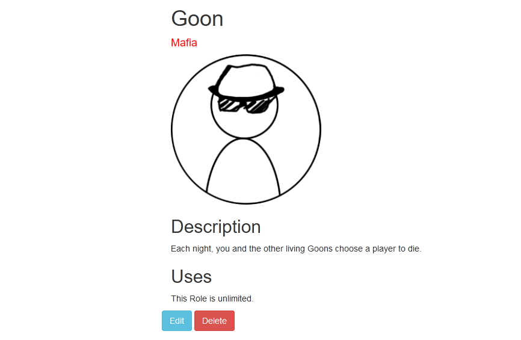
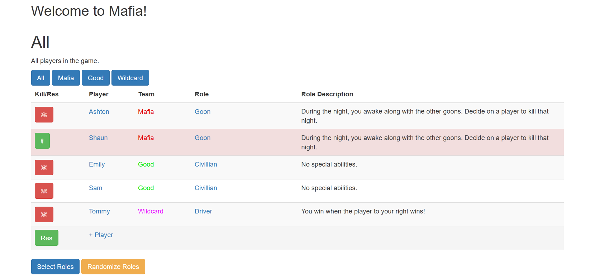
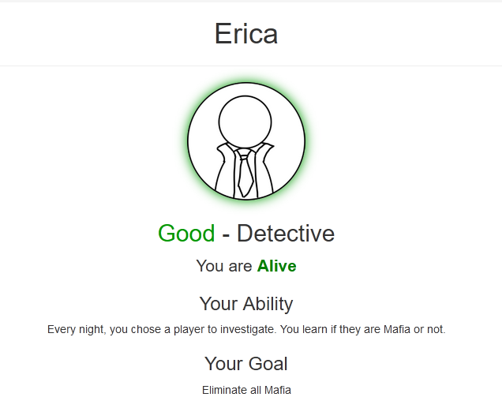

<h1 align="center">Mafia Web App</h1>

Classic Social Deduction party game, now extended with the power of the web.

## Description

This app is designed for Narrators to run a game of Mafia, without the need for a deck of cards, or memorizing abilities. It also enables Narrators to create their Own version of Mafia, with custom roles, teams, and abilities.

## Features

### Teams

Create custom Teams with an Image, Flavor Description and Win Condition

### Roles & Players

Create custom Roles on a Team with an Icon, Ability Description, and other config rules. Add Players and assign them the roles

### Game Screen

Interactive game control panel for the narrator to select and assign roles, manage player living states, and view team win conditions and abilities

### Player Screen

Mobile-first Player view that players can use to see their role, living state, abilities and win conditions with Narrator Authentication and Security Features.

## Tools

## How does it Work?
A narrator launches the game, and logs into the control pannel. There they can define Teams, create roles, and add players. Once the game is setup and ready, the Players can navigate to the local web address, and log in with their name. If they are in the game, they can see what role they are.

The Player view is designed so that players can just access the game from their phone, in place of the standard playing card that is traditionally used for Mafia. The players will be able to see updates when something changes (when they die, their role/team changes, etc);

## Future Development
The following features are to be added in the future:
- Live game updates: changes on the narrator control panel automatically refresh the player view
- Advanced game configuration settings
- Role security with error handling
- Role quick reference guide for players

## Sources

Mafia Icon - https://www.amazon.ca/Vintage-Gangster-Silhouette-Cartoon-Sticker/dp/B073XV2QHP

Good Icon - https://town-of-salem.fandom.com/wiki/Town_of_Salem_Wiki?file=Amnesiac+icon.png

Wildcard Icon - https://www.flaticon.com/free-icon/joker-hat_1924

Default Team Icon - https://www.dreamstime.com/
